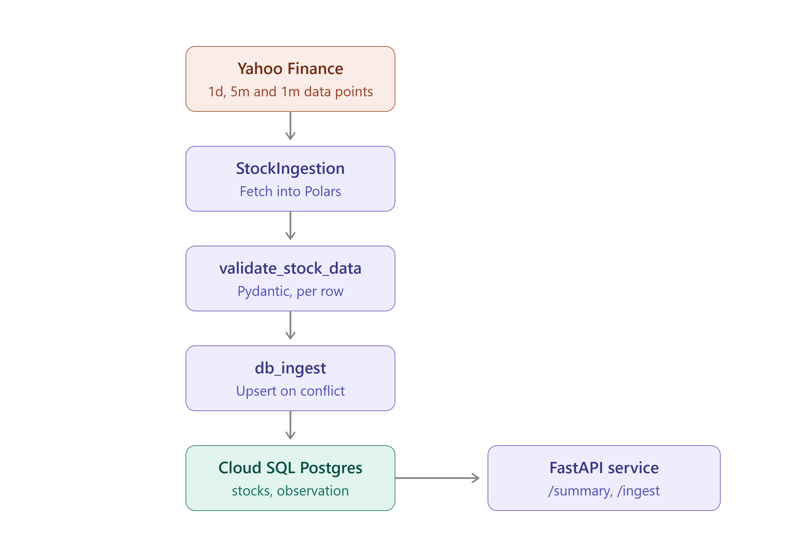
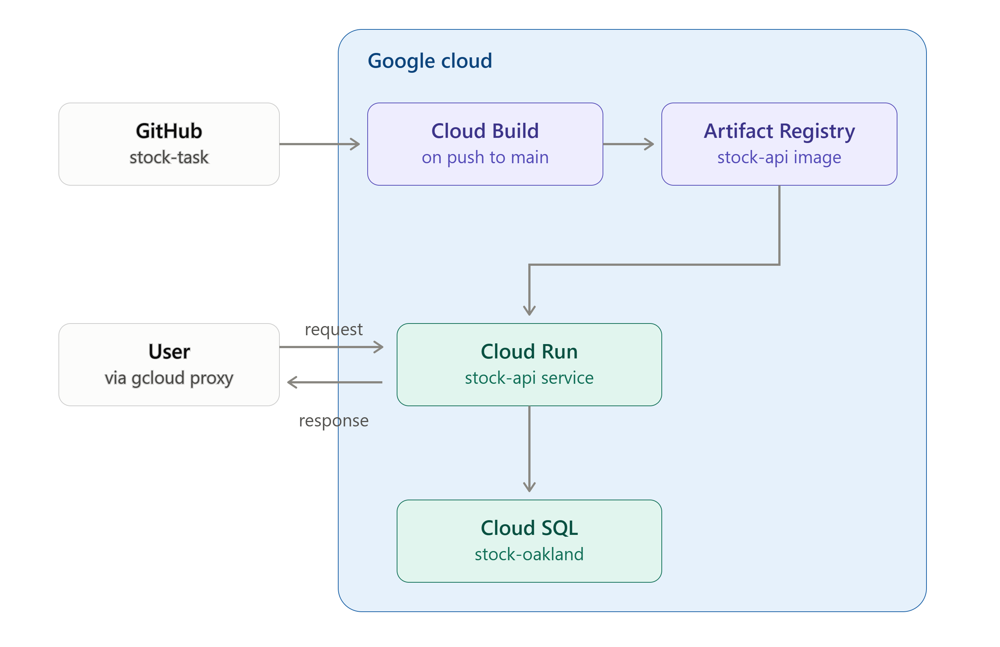

# Stock Data Pipeline

A pipeline that pulls AAPL (Apple) price history from Yahoo Finance, validates it against a
Pydantic schema, upserts it into a Cloud SQL PostgreSQL instance and serves a summary of the stored data through a FastAPI endpoint.

The project is containerised using Docker and deployed using Google Cloud Run on GCP (Free-Tier). Two API endpoints are surfaced and can be accessed locally or through connecting to the Cloud Run instance through a proxy.

Data is stored in three intervals of 1 day, 5 minutes and 1 minute. For every refresh of the data, data is upserted into the DB capturing the last 8d worth of 1m intervals, the previous 52 days after that at 5m intervals and then a 5Y history at 1d intervals.

---

## Table of Contents

- [Setup](#setup)
  - [Option A: FastAPI via Cloud Run](#option-a-fastapi-via-cloud-run)
  - [Option B: Run Locally](#option-b-run-locally)
- [Endpoints](#endpoints)
  - [/summary](#summary)
  - [/ingest](#ingest)
- [Project Architecture](#project-architecture)
  - [Repository layout](#repository-layout)
  - [Architecture Diagram](#architecture-diagram)
  - [Deployment Diagram](#deployment-diagram)
  - [1. Stock ingestion (`stock_ingestion.py`)](#1-stock-ingestion-stock_ingestionpy)
  - [2. Shared helpers (`helper.py`)](#2-shared-helpers-helperpy)
  - [3. Schema and validation (`models.py` + `validation.py`)](#3-schema-and-validation-modelspy--validationpy)
  - [4. Database ingestion (`db_ingest.py`)](#4-database-ingestion-db_ingestpy)
  - [5. Database schema (`postgres_db/schema.sql`)](#5-database-schema-postgres_dbschemasql)
  - [6. File design: classes, attributes and methods](#6-file-design-classes-attributes-and-methods)
  - [7. Orchestration (`pipeline.py`)](#7-orchestration-pipelinepy)
  - [8. Serving layer (`api.py`)](#8-serving-layer-apipy)
  - [9. Packaging (`__init__.py`) and notebook (`notebooks/testing.py`)](#9-packaging-__init__py-and-notebook-notebookstestingpy)
  - [10. Testing (`tests/test_validation.py`)](#10-testing-teststest_validationpy)
  - [11. CI - Pre-commit hooks](#11-ci---pre-commit-hooks)
  - [12. CD - Docker Container (`Dockerfile`)](#12-cd---docker-container-dockerfile)

---

## Setup

### Install Google Cloud SDK & Google Cloud Proxy

*Note*: Assumes the user has service account permission to use the gcloud proxy and connect to the Cloud Run instance.

Install the Google Cloud SDK (Debian/Ubuntu) & authenticate: https://docs.cloud.google.com/sdk/docs/install-sdk#deb

```bash
gcloud init
gcloud config set project [project-id]
```

Install the Google cloud Proxy from the  *Download the Cloud SQL Auth Proxy* section: https://docs.cloud.google.com/sql/docs/mysql/connect-auth-proxy

### Option A: FastAPI via Cloud Run

#### Set up the connection via Cloud Proxy

```bash
gcloud run services proxy stock-api --region=europe-west2 --port=8080
```

### Option B: Run Locally

*Note*: Assumes use of the uv package manager (https://docs.astral.sh/uv/)

#### Clone the repo

```bash
git clone https://github.com/MuizzQ1/stock-task.git
cd stock-task
```

#### Create virtual environment & install dependencies

```bash
uv venv
uv sync
```

#### Add secret & credentials to .env

```bash
DB_HOST=[...]
DB_PORT=[...]
DB_NAME=[...]
DB_USER=[...]
DB_PASSWORD=[...]
```

#### Create connection to Cloud SQL Postgres Instance

*Note*: Assumes permissions are enabled to access the Cloud SQL instance and that the Auth Proxy Client is downloaded (https://docs.cloud.google.com/sql/docs/postgres/connect-instance-auth-proxy)

```bash
./cloud-sql-proxy [INSTANCE_CONNECTION_NAME]
```

#### Connect to APIs through running the FastAPI server

```bash
uv run fastapi dev aapl_stock/api.py --port 8080
```

**Or**

#### Run through Docker locally

```bash
docker build -t stock-api .
docker run \
  --rm \
  -p 8080:8080 \
  --add-host=host.docker.internal:host-gateway \
  --env-file .env \
  -e DB_HOST=host.docker.internal \
  stock-api
```

## Endpoints

Run the following to hit either endpoint.

### /summary

GET HTTP method. Returns a row corresponding to a summary of the data per time interval [1m, 5m, 1d].

- Max, min and avg of the close data.
- Days captured per time interval.
- First timestamp captured
- Last timestamp captured

```
http://127.0.0.1:8080/summary
```

### /ingest

POST HTTP method. Extracts data from the yfinance API and upserts data into the Cloud SQL Postgres instance based on the stock_code, interval and timestamp of the stock price.

```
curl -X POST http://127.0.0.1:8080/ingest 
```

---

## Project Architecture

The project is built upon: **extraction**, **transformation**, **validation**, **loading into a database** and **serving**. Each stage is a small module which can be tested, validated and changed.

### Repository layout

```
stock-task/
├── aapl_stock/                 # The installable package
│   ├── __init__.py             # Package exports — makes the folder importable as `aapl_stock`
│   ├── __main__.py             # CLI entry point: `ingest` and `summary` commands
│   ├── stock_ingestion.py      # Extract & Transform data from Yahoo Finance (yfinance)
│   ├── helper.py               # Shared transform functions used across modules
│   ├── models.py               # Pydantic schemas (StockData, StockSummary)
│   ├── validation.py           # Row-level validation against the StockData schema
│   ├── db_ingest.py            # Load: Upsert into Postgres + run observability
│   ├── pipeline.py             # Pipe together stock_ingestion + db_ingest
│   └── api.py                  # Serving layer: FastAPI app (/summary, /ingest)
├── postgres_db/
│   └── schema.sql              # Schema for the `stocks` and `observation` tables
├── tests/
│   └── test_validation.py      # Unit tests for stock_ingestion.py output
├── notebooks/
│   └── testing.py              # marimo notebook for development and exploration
├── .pre-commit-config.yaml     # ruff, sqlfluff, gitleaks, pytest hooks
├── .sqlfluff                   # SQL linting rules (postgres dialect)
├── Dockerfile                  # Container image for the FastAPI app
└── pyproject.toml              # Project dependencies and project config
```

### Architecture Diagram

How data moves through the package, from Yahoo Finance to the FastAPI endpoints.



### Deployment Diagram

How the repo is built and released onto Google Cloud using Cloud Run.



- Push to *main* triggers Cloud Build on Google Cloud, which builds an image using the Dockerfile and stores it in Artifact Registry.
- Cloud Run creates the container upon an API request using the docker image (cold start) if required.
- The container either upserts or queries data from Cloud SQL.
- The API result is returned to the user.

### 1. Stock Ingestion (`stock_ingestion.py`)

`StockIngestion` is the extraction layer. Uses a `yfinance` object for AAPL stock and exposes method `stock_data_refresh()`. Returns a Polars DataFrame containing three different granularities of AAPL price history.

Yahoo Finance restricts how far back one can fetch data at a certain interval:

- 8 days of 1-minute
- 60 days of 5-minute

From the day before a refresh trigger, the data looks back at 1 minute intervals of the last 8 days, 5 minute intervals for 52 days and for 5Y from there at a daily basis.

Achieved through three extractions and a final concatenation.

Logs processed to ensure no overlapping / redundant data is extracted.

### 2. Shared Helpers (`helper.py`)

`helper.py` contains simple helper functions used in some processing files.

**`dt_conv(df, date)`**

Remove timezone from the final output. Standardise date column names.

**`col_processing(df, interval)`**

Add in AAPL stock code column. Standardise column names. Remove redundant columns.

### 3. Schema and Validation (`models.py` + `validation.py`)

The schema is **declared** in `models.py` and **validated** in `validation.py`.

**`models.py`** defines two Pydantic models:

*StockData* is the schema for the output of `stock_ingestion.py`.

Quality Checks:

- Uppercase for stock code
- Interval time must be one of [1m, 5m, 1d]
- Stock timestamp must be of datetime format
- All prices must be positive. This catches NULL, negative values and strings
- Volume not less than 0

*StockSummary* is the schema for the /summary FastAPI endpoint, allowing validation of the schema before it reaches a user.

**`validation.py`** surfaces `validate_stock_data(rows)` method to assert each row of data extracted from Yahoo Finance before upload into the database. Valid and invalid rows are split.

The per-row approach means one malformed row does not discard an entire ingest dataset.

### 4. Database Ingestion (`db_ingest.py`)

`postgress_ingestion` is the load layer. Its `refresh(df)` method:

- Predefine attributes of the upsert SQL, observation layer SQL and DB credentials.
- Connect to DB using `psycopg`. Error handling for faulty connection.
- Validate the DataFrame.
- Allow connection rollback for the observation layer data transaction.

### 5. Database Schema (`postgres_db/schema.sql`)

Two tables:

- **`stocks`** - Simple schema:

```SQL
CREATE TABLE stocks (
    stock_code TEXT NOT NULL,
    interval_time TEXT NOT NULL,
    ts TIMESTAMP NOT NULL,
    stock_open NUMERIC,
    stock_high NUMERIC,
    stock_low NUMERIC,
    stock_close NUMERIC,
    volume BIGINT,
    ingested_at TIMESTAMP NOT NULL DEFAULT now(),
    PRIMARY KEY (stock_code, interval_time, ts)
);
```

- **`observation`** — the run log:

```SQL
CREATE TABLE observation (
    run_id SERIAL PRIMARY KEY,
    rows_upserted INT,
    error TEXT,
    run_at TIMESTAMP NOT NULL DEFAULT now(),
    status TEXT NOT NULL
);
```

### 6. File Design: classes, attributes and methods

Ingestion files (stock data and DB ingestion) are set up using class methods and attributes.

Benefits:

- Credentials are set up in a single instance during class initialisation.
- Use methods as a sequence of steps in orchestrating ingestion.
- Ability to test each object independently. `StockIngestion` can be extracted in a notebook
  and `postgress_ingestion` can be handed a test DataFrame without extracting from Yahoo Finance.

### 7. Orchestration (`pipeline.py`)

Pipe class methods together under `run_pipeline()` to build an E2E pipeline from Yahoo Finance into the Cloud SQL Postgres DB.

```python
st = StockIngestion()
df_stocks = st.stock_data_refresh()

db_ingest = postgress_ingestion()
db_ingest.refresh(df=df_stocks)
```

### 8. Serving Layer (`api.py`)

The serving layer uses **FastAPI**:

`POST /ingest`

- Leverages `run_pipeline()`.

`GET /summary`

- Executes a SQL query against the DB and returns JSON output to the user.

```SQL
    SELECT
        stock_code,
        interval_time,
        count(*) AS data_points,
        min(ts) AS first_ts,
        max(ts) AS last_ts,
        max(ts)::date - min(ts)::date AS days_spanned,
        round(min(stock_close), 2) AS min_close,
        round(max(stock_close), 2) AS max_close,
        round(avg(stock_close), 2) AS avg_close
    FROM stocks
    GROUP BY stock_code, interval_time
    ORDER BY max(ts) DESC
```

### 9. Packaging (`__init__.py`) and notebook (`notebooks/testing.py`)

`__init__.py` converts the folder to a usable package, so every component can be pulled in with a single import:

```python
from aapl_stock import StockIngestion, validate_stock_data, postgress_ingestion, run_pipeline
```

`notebooks/testing.py` is a **marimo** notebook used for quick prototyping and development. All methods/functions are called and tested in the notebook environment before being finalised.

Marimo benefits:

- **Plain `.py` file** — reviews in git like any other source file.
- **SQL and Python in one document** — query the live Cloud SQL instance and
  return DataFrames that the next Python cell can use.
- **Reactive cells** — re-running a cell updates all instances of named variables, so no stale cells — quick development.

Run the notebook with:

```bash
uv run marimo edit notebooks/testing.py
```

### 10. Testing (`tests/test_validation.py`)

Unit tests with **pytest** covering `validate_stock_data`. Funnel in faulty data to check if the Pydantic schema is separating rows as intended:

- Null price, negative price, non-numeric volume and an invalid interval are each rejected.
- A mixed batch keeps the valid rows and rejects only the bad one.

Run with:

```bash
uv run pytest
```

Tests also run on every commit as a pre-commit hook.

### 11. CI - Pre-commit hooks

`.pre-commit-config.yaml` runs **ruff** (lint + format), **sqlfluff**, **gitleaks** and **pytest**.

Run the following to execute pre-commit hooks on the repo:

```bash
pre-commit run --all-files
```

### 12. CD - Docker Container (`Dockerfile`)

- Built on Python 3.14.
- uv binaries copied in from the official image.
- Install dependencies from `pyproject.toml` + `uv.lock` first (`--no-install-project`),
  then the package.
